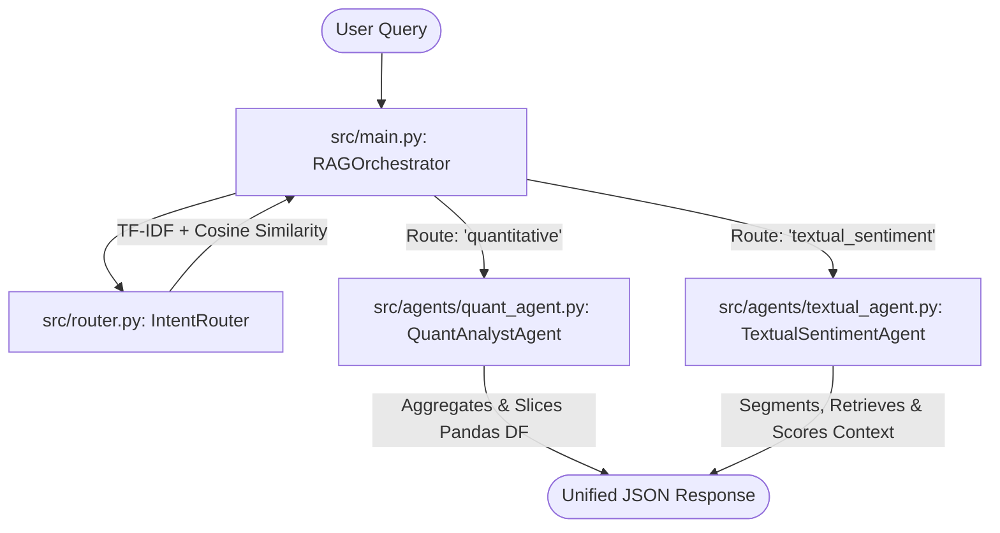

# Multi-Agent RAG Analyst Routing Engine

A production-ready, lightweight financial natural language processing (NLP) orchestration engine. This system automatically classifies incoming corporate queries and routes them to specialized agents: a **Quantitative Analyst Agent** (for tabular spreadsheet calculations) or a **Textual Sentiment Agent** (for unstructured document mining and risk indexing).

## 🚀 Key Features
- **Semantic Intent Routing:** Uses `TfidfVectorizer` and `cosine_similarity` to classify queries into appropriate agent tracks under ~5ms.
- **Rule-Based RAG Context Retrieval:** Segments unstructured corporate texts, retrieves the most query-relevant paragraphs, and computes sentiment/risk density on the retrieved context.
- **Robust Local Processing:** Leverages native `pandas` and regular expressions with word boundary checks (`\b`) to query structured databases accurately without false positive matches (such as separating ticker words from common query substrings).
- **Modern Python Architecture:** Full type annotations, clean separation of concerns, and robust error boundaries.
- **Framework-Free:** Avoids heavy third-party agent systems (like LangChain or LlamaIndex) for minimal dependency overhead.

---

## 📐 System Architecture



---

## 📂 Repository Structure

```text
├── data/
│   ├── financial_metrics.csv     # Structured corporate quarterly metrics
│   └── annual_report.txt         # Unstructured shareholder letter and risks
├── src/
│   ├── agents/
│   │   ├── __init__.py
│   │   ├── quant_agent.py        # Performs tabular filters/aggregates
│   │   └── textual_agent.py      # Segments, retrieves context, and scores sentiment
│   ├── __init__.py
│   ├── main.py                   # System entry point and orchestrator
│   └── router.py                 # Intent router classifier
├── .gitignore                    # Git file exclusions
├── requirements.txt              # Project package requirements
└── README.md                     # Project documentation
```

---

## 🛠️ Quick Start

### 1. Prerequisites
Ensure you have Python 3.8+ installed on your system.

### 2. Install Dependencies
Clone the repository and install the package requirements:
```bash
pip install -r requirements.txt
```

### 3. Run the Demonstration
Run the orchestration engine suite containing 8 validation queries (both quantitative and qualitative):
```bash
python src/main.py
```

---

## 📊 Sample Queries & Agent Responses

### Quantitative Agent Route
- **Query:** *"What is the average revenue across all tickers?"*
- **Response:** `The average revenue for all companies is 96.6.`
- **Query:** *"What was Apple's net income for Q2?"*
- **Response:**
  ```text
  Found 1 metrics for net income:
  AAPL (Q2_2025): 21.0
  ```

### Textual Sentiment Agent Route
- **Query:** *"Summarize key competition and supply chain threats."*
- **Response:**
  ```text
  Textual sentiment analysis of the retrieved context:
  - Overall Sentiment: Negative (Score: -1.0)
  - Risk/Uncertainty Density: 6.55%
  - Key Positive Words: None
  - Key Risk Words: vulnerability, failure, risk, threat, uncertainty, competition, challenge

  Retrieved Document Context:
  --- SECTION 1: MARKET AND COMPETITION RISKS ---
  We operate in an highly competitive industry...
  --- SECTION 3: SUPPLY CHAIN AND LOGISTICS UNCERTAINTIES ---
  Our hardware production capabilities depend heavily...
  ```
